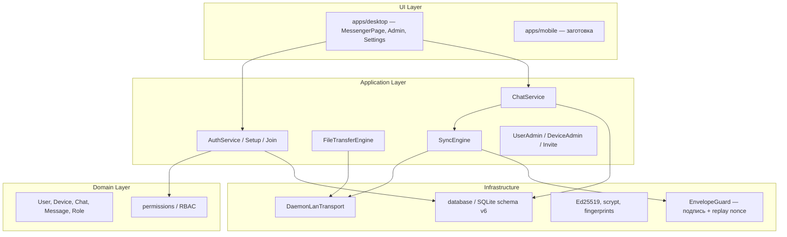

# Architecture

## Сравнение вариантов стека

| Критерий | A: Tauri 2 + React + Rust daemon + Expo | B: Electron + React + Node P2P | C: Flutter + Rust FFI |
|---------|------------------------------------------|--------------------------------|------------------------|
| Desktop | Нативный, лёгкий | Тяжёлый runtime | Хорошо |
| Mobile | Expo/RN, общий TS domain | Отдельный RN | Единый UI |
| P2P | Rust daemon: mDNS, UDP, TCP | Node (слабее для mobile bg) | Через FFI |
| Security | Keychain (план) + Ed25519 в TS | Сложнее hardening | Хорошо |
| Offline/SQLite | sql.js (UI) + persist в localStorage | better-sqlite3 | drift/sqflite |
| Maintainability | Monorepo TS + Rust sidecar | Много Node native | Другой UI стек |

**Выбор: вариант A** — React, Tauri, Rust networking, будущий Expo; без обязательного центрального сервера.

## Слои



## Monorepo

```
apps/
  desktop/          # Vite + React + Tauri 2 (sidecar lockal-daemon)
  mobile/           # Expo placeholder
packages/
  shared/           # IDs, protocol envelope
  domain/           # entities, enums
  permissions/      # RBAC
  crypto/           # keys, passwords, fingerprints, envelope signing
  database/         # sql.js, schema v6, repositories, localStorage persist
  messaging/        # ChatService, MessageRepository
  file-transfer/    # chunks, blob store, pause/resume/retry
  networking/       # NetworkTransport, DaemonLanTransport
  sync/             # SyncEngine, directory sync, EnvelopeGuard
  application/      # setup, join, auth, admin, network-service
  ui/               # i18n, theme
crates/
  lockal-daemon/    # mDNS + UDP + TCP + WS для UI
  lockal-core/      # план: rusqlite, Argon2id, OS keychain
docs/
logo.png            # исходник иконки приложения
```

## Desktop UI

После входа каркас один и тот же (`AppSidebar`) на Чатах, Контактах, Настройках и Админке.

Страница чатов (`MessengerPage`) — три колонки:

1. Навигация (Чаты подсвечены и на `/app`, и на `/chat/:userId`)
2. Список диалогов: аватар, превью (`Вы: …` для своих), время, непрочитанные
3. Переписка: пузыри, галочки отправки/доставки/прочтения, composer (Enter — отправить, Shift+Enter — новая строка)

Тема оформления задаётся только в Настройках.

## Данные

- SQLite в sql.js, сериализация в `localStorage` (`lockal.sqlite`), persist **с debounce ~400 ms**, flush на `beforeunload`
- Схема **v6**: чаты, сообщения, outbox, файлы, `seen_envelopes` (replay), `chat_members.last_read_at` (unread + read receipts)
- Блобы файлов: IndexedDB `lockalchat-blobs`
- Сессия: `lockal.session`, устройство: `lockal.deviceId`
- **Отвязать устройство** (Настройки) удаляет все ключи `lockal.*` / `lockal.secure.*` и IndexedDB, затем reload — Join снова возможен

## Сеть и процесс daemon

- UI говорит с `lockal-daemon` по WebSocket (`127.0.0.1:39201` по умолчанию)
- Discovery: mDNS + UDP, затем TCP между пирами
- В Tauri sidecar стартует после логина / если уже есть config; на `RunEvent::Exit` процесс **убивается**, чтобы не висеть после закрытия окна

LockalChat **не** создаёт TUN/VPN и не меняет системный маршрут.

## Администрирование

Без центральной БД изменения каталога уходят как `sync.envelope` (directory snapshot). Invite — JSON `OrganizationInviteV1` (org + user roster + устройства). Повторный Join на устройстве, где уже есть организация, отклоняется, пока локальные данные не сброшены.
